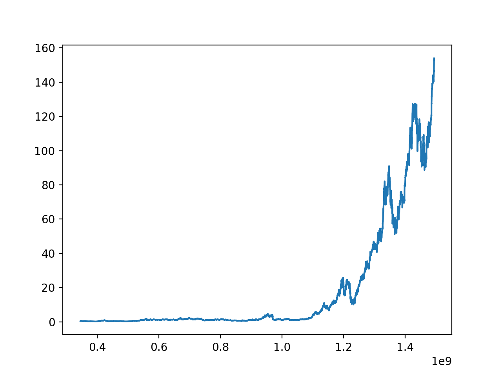

Stocks
======

This folder contains the explorationg of stock analysis through the use of python and its various math/data modules. This file should be read as a direct and non-academic tutorial on stock analytics.

## Goal
* learn
  * python
  * tensorflow
  * matplotlib
  * numpy
* ?
* profit

*The "?" is a metaphor for the machine learning process where the programmer has no idea how the nodes are truly interconnected*

## The setup
My computer has a folder `$HOME/data/stocks/` with `.csv` files of historical stock data from the Dow Jones composite.

Software:
* python 3.6.1
* tensorflow 1.2.1
* numpy 1.13.0
* matplotlib 2.0.2
* atom w/ hydrogen package
* jupyter/ipython

## First step
My first step was ploting the adjusted closing price with respect to time using matplotlib. Firstly I parsed the `csv` with the following code:

``` python
import csv
import datetime as dt

date = []
price = []
with open('/Users/julio/data/STOCKS/AAPL.csv') as data:
        reader = csv.DictReader(data)
        for row in reader:
            date.append(dt.datetime.strptime(row['Date'], '%Y-%m-%d').timestamp())
            price.append(row['AdjClose'])

```

The parallel arrays setup worked well at first, using each list as a parameter to matplotlib's plot function

``` python
import matplotlib.pyplot as plt

#get csv code here

plt.plot(date, price)
plt.show()

```

`stocks.py` :

``` python
import csv
import datetime as dt
import matplotlib.pyplot as plt

date = []
price = []
with open('/Users/julio/data/STOCKS/AAPL.csv') as data:
        reader = csv.DictReader(data)
        for row in reader:
            date.append(dt.datetime.strptime(row['Date'], '%Y-%m-%d').timestamp())
            price.append(row['AdjClose'])


plt.plot(date, price)
plt.show()
```

output:


**_Conclusion:_**
Well there is data on a graph. It's not very helpful aside from telling me that my parents should have bought Apple stocks 0.4e9 milliseconds(?) after 1 Jan 1970. It would be helpfull if I could pan and scale the time of the graph. I can with the matplotlib screen but it would significantly slow down my workflow. This leads me to the next step.

## Streamlined graphing and simplified mathematics

In order to optimize workflow I moved the read and parse code into a function

Besides the issue with workflow speed, the current parallel list becomes messy when used alogside with numpy and its ndarray returning functions.
